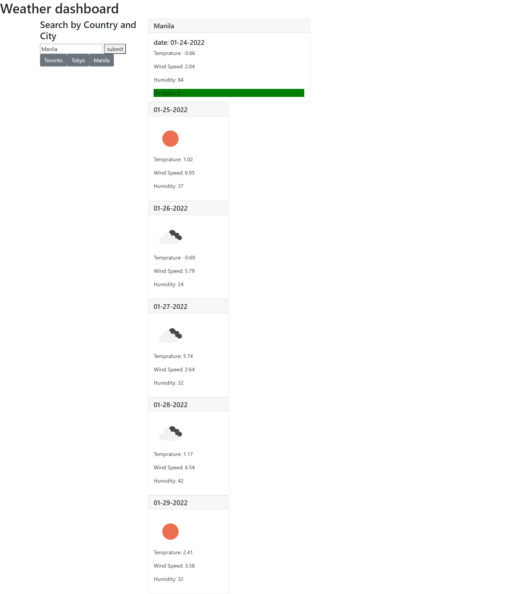

# Weather Dashboard
  
 
 ## Description
 
 This application allows you to type in a city name and get a daily weather update and the forcast for the following 5 days
  

 ## Table of Contents
 * [Installation](#Installation)
 * [Usage](#Usage)
 * [Technologies](#Technologies)
 * [Contributing](#Contributing)
 * [Tests](#Tests)
 * [Questions](#Questions)
 
 ## Installation
 go to the deployed link to use to app here https://maks-pixel.github.io/whats-the-weather/ or download the repository and open the html page in your browser

 ## Usage
 type in the city you want to get the weather forcast for and press the submit button to get the weather. Or get previously looked up cities by clicking on the buttons bellow the search bar with the city name 

 ## Technologies
 In this project i used 2 APIs:
    -Geotag API to locate the latitude and longitude of the city unput that would be passed along to...
    -the weather API that will give the infotmation regarding that city
 the rest of the DOM manipulation was build with javascript and the styling and static parts of the site was built using simple CSS and HTML5

 
 ## Contributing
 N/A

 ## Tests
 N/A

 ## Questions
 here is the link to my Github: [github.com/maks-pixel](github.com/maks-pixel)
 If you have any questions regarding the project or anything else you can contact me at:
 
  Email: [makdagirmay4@gmail.com](makdagirmay4@gmail.com) 
