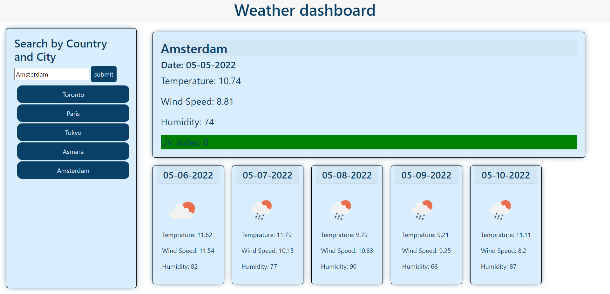

# Weather Dashboard
  
 
 ## Description
 
 This application allows you to type in a city name and get a daily weather update and the forcast for the following 5 days
  

 ## Table of Contents
 * [Installation](#Installation)
 * [Usage](#Usage)
 * [Contributing](#Contributing)
 * [Tests](#Tests)
 * [Questions](#Questions)
 
 ## Installation
 go to the deployed link to use to app here https://maks-pixel.github.io/wk6whats-the-weather/ or download the repository and open the html page in your browser

 ## Usage
 type in the city you want to get the weather forcast for and press the submit button to get the weather. Or get previously looked up cities by clicking on the buttons bellow the search bar with the city name 
 
 ## Contributing
 N/A

 ## Tests
 N/A

 ## Questions
 here is the link to my Github: [github.com/maks-pixel](github.com/maks-pixel)
 If you have any questions regarding the project or anything else you can contact me at:
 
  Email: [maksgirmay@gmail.com](maksgirmay@gmail.com) 